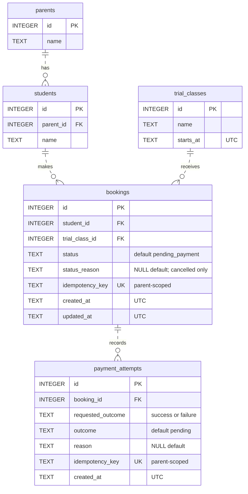
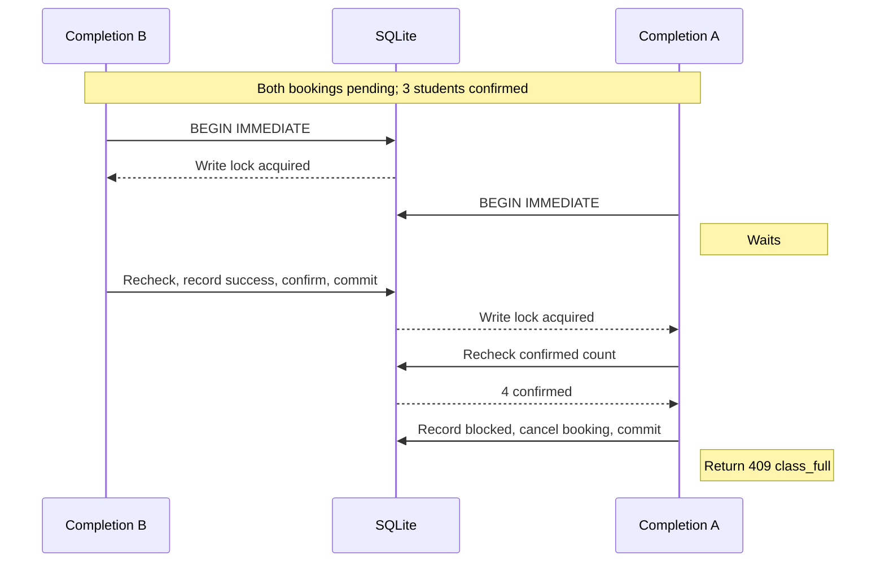
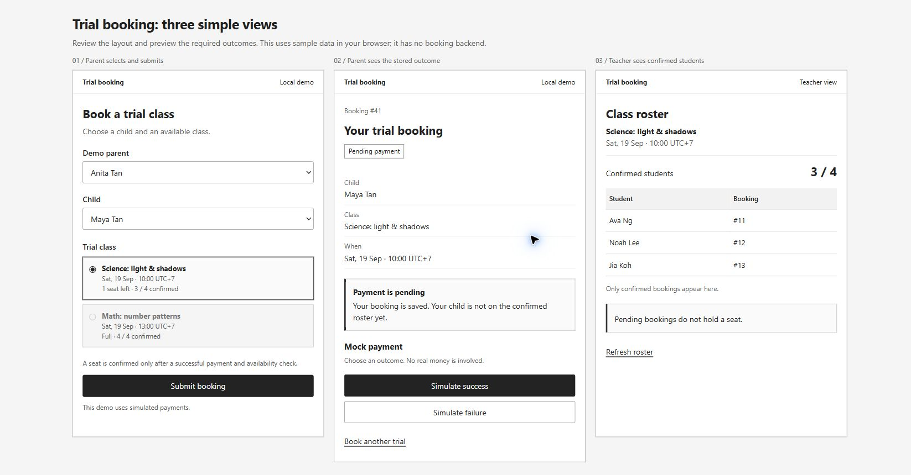

# Trial booking solution

Status: design recorded; implementation has not started. The [implementation plan](trial_booking_implementation_plan.md) owns execution rules, remaining tasks, and the time budget.

## Goal and timebox

Build the smallest trial-booking flow that handles payment failure, duplicate bookings, capacity, and the last-seat race.

The assessment sets the priority:

> A polished frontend is not required. A simple UI is useful, but we care more about the data model, backend logic, invariants, tests, and your explanation. A CLI, script, API endpoint, server action, or minimal app is fine if it shows your thinking clearly.

The four-hour cap includes implementation, tests, documentation, verification, and the video.

## Selected approach

| Part | Choice | Why |
| --- | --- | --- |
| Backend | Python with FastAPI | Familiar stack with request validation and OpenAPI. |
| UI | Jinja, plain HTML forms, and plain CSS | One process and no frontend build step. |
| Database | SQLite | Local, portable, and enough to prove the required transaction behavior. |
| Payment | Deterministic local simulator | Reproducible success and failure without credentials or network calls. |
| Tests | pytest + FastAPI TestClient (httpx) | Real SQLite checks and HTTP/form assertions. |
| Lint/format | Ruff | One tool for both checks. |
| Monitoring | Standard-library JSON logs and `/v1/health` | Local diagnostics without an account or extra package. |

The UI has three low-fidelity views: book a trial, view booking status, and view the confirmed roster.

Stripe was investigated and rejected for this submission. A correct local integration needs reviewer-managed secrets and webhook setup, while a hosted or hybrid version adds scope. Reconsider it only if a real provider becomes a requirement.

## Folder structure

```text
booking-trial-class/
|-- .artifacts/                 # Existing assessment source; locally ignored
|-- .specs/                     # Existing design discussion and diagrams
|   `-- trial_booking_solution.md
|-- .steering/                  # Existing Python and API guidance
|-- app/
|   |-- __init__.py
|   |-- main.py                # App setup, router registration, common HTTP errors
|   |-- api/
|   |   |-- __init__.py
|   |   |-- bookings.py        # JSON request and response handling
|   |   `-- pages.py           # Page rendering and HTML form handling
|   |-- schemas/
|   |   |-- __init__.py
|   |   `-- bookings.py        # Pydantic request and response contracts
|   |-- services/
|   |   |-- __init__.py
|   |   `-- bookings_svc.py    # Booking rules, queries, confirmation transaction
|   |-- db/
|   |   |-- __init__.py
|   |   |-- connection.py      # SQLite connections and explicit database setup
|   |   |-- schema.sql         # Tables, indexes, and constraints
|   |   `-- seed.sql           # Synthetic demo records
|   |-- templates/
|   |   |-- base.html
|   |   |-- book_trial.html
|   |   |-- booking_status.html
|   |   `-- roster.html
|   `-- static/
|       `-- styles.css
|-- tests/
|   |-- conftest.py             # Fresh seeded database and shared test setup
|   |-- test_bookings.py        # Booking rules and persisted outcomes
|   |-- test_race.py            # Competing confirmations against one database
|   `-- test_http.py            # API contracts and HTML form flow
|-- var/                       # Generated local data; add to .gitignore
|   `-- trial-booking.sqlite3
|-- .gitignore
|-- AGENTS.md
|-- pyproject.toml             # Dependencies and chosen test/lint configuration
|-- README.md
`-- AI_USAGE.md
```

- Use `*_svc.py` for service files and keep the logic in plain functions.
- Both route modules call `services/bookings_svc.py` directly. It owns booking SQL and the confirmation transaction.
- `db/connection.py` uses `sqlite3` and opens one connection per operation. Load schema and seeds explicitly; startup must not reset data.
- Race tests use separate connections to the same temporary database.
- Keep generated `var/` data out of Git.

## Scope

Included:

- Choose a child and an available trial class.
- Submit a trial booking.
- Record a mock payment result.
- Show the booking status.
- Show the confirmed roster to an admin or teacher.
- Seed the required examples.
- Test duplicate, failure, capacity, and race behavior.

Excluded:

- Regular enrollment.
- Real sign-in and role administration. The parent-child relationship still belongs in the data model.
- A real payment provider.
- Deployment and production infrastructure.
- Frontend polish beyond a clear, accessible form and tables.
- Background jobs and speculative extension points.

## Business rules

| Rule | Enforcement | Proof |
| --- | --- | --- |
| A class has at most four confirmed students. | Transactional count check plus a database confirmation guard. | Capacity and race tests, including direct SQL writes. |
| A child has at most one confirmed booking for a class. | Backend check plus a database uniqueness rule. | Duplicate and concurrent confirmation tests. |
| Failed payment never confirms a booking. | Store the failed attempt and set `payment_failed`. | Payment-failure test and roster assertion. |
| The roster contains confirmed bookings only. | Filter by `confirmed` in the roster query. | Roster test. |
| Availability before payment is advisory. | Check again when payment completes. | Last-seat race test. |
| UI checks do not protect data. | Keep authoritative checks in the backend and database. | Direct API and service tests. |

## Database model and write rules

Use five [SQLite STRICT tables](https://sqlite.org/stricttables.html), requiring SQLite 3.37 or later. Each `id` is an `INTEGER PRIMARY KEY`. All other columns are `NOT NULL` except those marked `?`, which default to `NULL`.

| Table | Columns besides `id` |
| --- | --- |
| `parents` | `name TEXT` |
| `students` | `parent_id INTEGER` referencing `parents.id`; `name TEXT` |
| `trial_classes` | `name TEXT`; `starts_at TEXT` |
| `bookings` | `student_id INTEGER` referencing `students.id`; `trial_class_id INTEGER` referencing `trial_classes.id`; `status TEXT DEFAULT 'pending_payment'`; `status_reason TEXT?`; `idempotency_key TEXT UNIQUE`; `created_at TEXT`; `updated_at TEXT` |
| `payment_attempts` | `booking_id INTEGER` referencing `bookings.id`; `requested_outcome TEXT`; `outcome TEXT DEFAULT 'pending'`; `reason TEXT?`; `idempotency_key TEXT UNIQUE`; `created_at TEXT` |

Foreign keys use `ON DELETE RESTRICT` and `ON UPDATE RESTRICT`; enable enforcement on every connection. Names must satisfy `length(trim(name)) > 0`.

Store timestamps as UTC text in `YYYY-MM-DDTHH:MM:SS.ffffffZ` format. The backend validates dates and generates audit times; class start times come from the seed schedule. `bookings.created_at` records submission, `updated_at` records the last state change, and the attempt timestamp supports payment diagnostics. Replays change none of them. Parents and students need no audit timestamps in this slice.

The demo selector supplies a seeded parent context; it does not authenticate a person. List that parent's children and check ownership when creating, reading, or paying for a booking. Each child has one parent; ownership transfers are outside scope. Resolve a booking's parent through its student.

The roster is a query over confirmed bookings joined to students. Capacity is fixed at four; neither capacity counters nor a roster table are stored.

### Constraints

| Protection | Database rule |
| --- | --- |
| Duplicate confirmed child/class | A unique index on `(trial_class_id, student_id)` where `status = 'confirmed'`. It also supports the confirmed roster/count query. |
| Repeated request | `idempotency_key` is unique within each operation's table. Store the parent-scoped key described below. |
| Repeated successful payment | A unique index on `payment_attempts(booking_id)` where `outcome = 'succeeded'`. |
| Booking state | `CHECK` allows only `pending_payment`, `confirmed`, `payment_failed`, `cancelled`. Only cancelled bookings have a non-null `status_reason`, restricted to `class_full` or `duplicate_booking`. |
| Payment state | `CHECK` allows `requested_outcome` in `success`, `failure` and enforces the outcome/reason combinations below. |
| Confirmation and capacity | Booking inserts must start pending. On transition to confirmed, require a succeeded attempt for this booking and fewer than four other confirmed bookings in its class. |
| Terminal consistency | On transition to `payment_failed`, require a failed attempt; on transition to `cancelled`, require a blocked attempt with the same reason. |
| Immutable records | Bookings and attempts allow only pending-to-terminal state changes. Their IDs, foreign keys, request keys, requested outcomes, and creation times cannot be rewritten. Finalized attempts cannot be updated or deleted. |

Use [partial unique indexes](https://sqlite.org/partialindex.html) for conditional uniqueness and rejecting [triggers](https://sqlite.org/lang_createtrigger.html) for the cross-row guards. Service checks provide useful errors; the database rejects invalid writes that bypass them. Seed confirmed bookings by first inserting pending bookings, then recording their payments and terminal states through these rules.

Required-reason branches must explicitly test `IS NOT NULL`; a `CHECK` expression that evaluates to SQL `NULL` must not bypass the rule. Keep insert guards separate from update guards so seed setup and terminal transitions remain valid.

Allowed payment combinations:

| `outcome` | `requested_outcome` | `reason` |
| --- | --- | --- |
| `pending` | `success` or `failure` | `NULL` |
| `succeeded` | `success` | `NULL` |
| `failed` | `failure` | `mock_declined` |
| `blocked` | `success` | `class_full` or `duplicate_booking` |

Attempt inserts must start pending. The service completes the attempt and booking together; a matching payment row alone does not update the roster.

### Request keys and booking creation

Booking and payment forms carry a generated key, reused for double-clicks and transport retries. API callers supply `Idempotency-Key`. Accept 1 to 128 characters, case-sensitive. The backend stores `<parent_id>:<client_key>`; the table identifies the operation. Keys are therefore scoped to parent plus booking creation, or parent plus payment completion, without another table or duplicated parent foreign keys.

| Request | Existing key | Different input with that key |
| --- | --- | --- |
| Create booking | Compare stored `student_id` and `trial_class_id`; return the same booking with its current status. | `409 idempotency_conflict` |
| Complete payment | Compare stored `booking_id` and `requested_outcome`; return the original attempt result, including a recorded failure or conflict. | `409 idempotency_conflict` |

For creation, start `BEGIN IMMEDIATE`, validate the parent/child/class, and check the key before availability. For a new key, reject an already-confirmed child/class pair or a full class with `409`; otherwise insert the pending booking with equal creation/update times and commit. A pending booking reserves no seat. Different keys can create separate pending bookings, but only one can confirm for a child/class pair.

Keys bind when a row is created. Requests rejected before execution create no row. Keep records for the life of the demo database so accepted requests remain replayable. A fresh payment key cannot reopen or repay a terminal booking; return `409 invalid_transition`. A separate booking after failure is not prohibited by the confirmed-only uniqueness rule, but there is no retry action on the failed booking.

### Table relationships



PK = primary key; FK = foreign key; UK = unique key. All columns are required except the two marked `NULL default`. Foreign-key updates and deletes are restricted. Each relationship links one row to zero or more dependent rows.

Constraints beyond the ER notation:

- `bookings`: unique `(trial_class_id, student_id)` only when `status = 'confirmed'`.
- `payment_attempts`: unique `booking_id` only when `outcome = 'succeeded'`. It is not globally unique.
- Names must be nonblank. State/reason checks and pending-to-terminal guards follow [Constraints](#constraints); confirmation requires a succeeded attempt and fewer than four other confirmed bookings.
- Request keys include the parent scope. Identity fields and creation times stay fixed; finalized attempts cannot be edited or deleted.

The roster is derived from confirmed bookings; it has no separate table.

[Editable diagram](trial_booking_relations.drawio).

## Payment flow

Choose `Simulate success` or `Simulate failure`. Store the payment result in `payment_attempts` and the reservation state in `bookings`.

| Event | Attempt outcome | Booking status |
| --- | --- | --- |
| Booking accepted | None | `pending_payment` |
| Payment fails | `failed` | `payment_failed` |
| Payment succeeds and booking checks pass | `succeeded` | `confirmed` |
| Class filled | `blocked`, reason `class_full` | `cancelled` |
| Another booking confirmed for this child/class | `blocked`, reason `duplicate_booking` | `cancelled` |

The completion function performs these steps in one `BEGIN IMMEDIATE` transaction:

1. Verify booking ownership, then replay or reject an existing request key before checking terminal status.
2. Require a pending booking and insert a pending attempt.
3. For requested failure, record `failed/mock_declined`. For requested success, check duplicate confirmation first, then capacity; record `blocked` with the applicable reason, or `succeeded`.
4. Update the booking to the matching terminal status and set `updated_at`. Commit both records before returning the outcome.

A blocked attempt simulates no charge and returns `409`. Unexpected failures roll back the entire transaction, including the attempt and its key. Translate duplicate/capacity constraint violations to `409`; other unexpected invariant violations are sanitized `500` errors. A retry after a lost response finds the committed outcome; a retry after rollback can execute afresh. No request-time path commits a pending attempt on its own.

## Last-seat race



`BEGIN IMMEDIATE` takes SQLite's write lock before the authoritative checks. Set a five-second busy timeout on each connection. A competing request waits, then reads the committed state; if the timeout expires, return retryable `503 database_busy` without partial writes. See [SQLite transactions](https://sqlite.org/lang_transaction.html).

For the brief's exact scenario, A and B both have pending bookings when the class has three confirmed students. B completes first and becomes the fourth. A's later success request records `blocked/class_full` and becomes cancelled. A simultaneous test must assert one winner, four total confirmed students, and a recorded blocked outcome for the loser. Timestamps never choose the winner.

This serializes confirmation writes. That is acceptable for the take-home. A multi-instance production service would need a server database with equivalent transactional locking or an atomic capacity update.

## API contracts

These contracts describe the local synthetic demo. JSON routes use `application/json`; responses use `{"data": [...], "meta": {...}}`. IDs are positive integers, public fields use `camelCase`, and timestamps use the database's UTC format. Reject unknown body fields and query parameters with `422`. JSON IDs must be numbers; paths, headers, and forms parse decimal text.

### Demo context and headers

Parent-scoped JSON routes require `X-Demo-Parent-Id`. The service resolves that seeded parent and checks student/booking ownership. Missing or malformed context returns `422`; an unknown parent returns `404`. The header simulates identity, not authentication. Parent/class listings and the teacher roster are public demo outputs.

Both JSON POST routes also require `Idempotency-Key` under the [request-key rules](#request-keys-and-booking-creation). The parent comes from demo context, never from a booking/payment request body. Reject client-supplied booking statuses, result reasons, timestamps, or scoped keys. Only `requestedOutcome` selects the mock result.

All responses carry a server-generated `X-Request-ID`. JSON data reads use `Cache-Control: no-store`. All canonical paths omit trailing slashes; slash variants return `404`.

### JSON routes

`Parent context` below means the demo header is required. GET routes have no request body or query filters; the seed dataset needs no pagination.

| Method and path | Context / request | Result |
| --- | --- | --- |
| `GET /v1/health` | Public; no demo context | `200`, Health; unavailable database `503` |
| `GET /v1/parents` | Public demo | `200`, Parent list |
| `GET /v1/students` | Parent context | `200`, that parent's Student list |
| `GET /v1/trial-classes` | Public demo | `200`, TrialClass list, including full classes |
| `POST /v1/bookings` | Parent context + key; `{"studentId": 1, "trialClassId": 2}` | `201`, Booking; replay `200` |
| `GET /v1/bookings/{bookingId}` | Parent context + ownership | `200`, Booking |
| `POST /v1/bookings/{bookingId}/payment-attempts` | Parent context + ownership + key; `{"requestedOutcome": "success"}` or `{"requestedOutcome": "failure"}` | `201`, finalized PaymentAttempt; replay `200`; blocked attempt `409` |
| `GET /v1/payment-attempts/{paymentAttemptId}` | Parent context + ownership through booking/student | `200`, PaymentAttempt, including a recorded failure or block |
| `GET /v1/trial-classes/{trialClassId}/roster` | Public teacher demo | `200`, confirmed RosterMember list |

POST bodies contain exactly the fields shown. Creation success/replay includes `Location: /v1/bookings/{id}`; payment success/replay includes `Location: /v1/payment-attempts/{id}`. Success metadata is `{"replayed": false}` for new writes and `{"replayed": true}` for replays.

A simulated decline returns `201` because its result was recorded successfully; the booking remains `payment_failed`. HTTP success does not mean a confirmed seat. Payment processing finishes within the request, so no `202` or polling operation is needed.

### Response records

Each singleton is still wrapped in a one-item `data` array. Empty lists return `data: []`. Do not expose stored idempotency keys.

| Record | Fields |
| --- | --- |
| Health | `status` (`"ok"`) |
| Parent | `id`, `name` |
| Student | `id`, `parentId`, `name` |
| TrialClass | `id`, `name`, `startsAt`, `capacity` (4), `confirmedCount`, `seatsRemaining` |
| Booking | `id`, `studentId`, `trialClassId`, `status`, nullable `statusReason`, `createdAt`, `updatedAt` |
| PaymentAttempt | `id`, `bookingId`, `requestedOutcome`, `outcome`, nullable `reason`, `createdAt`, `bookingStatus`, nullable `bookingStatusReason` |
| RosterMember | `bookingId`, `studentId`, `studentName` |

Names are strings; IDs and counts are integers. Status/outcome/reason values follow the database model. Availability derives from confirmed bookings in one query. Sort parents/students by ID, classes by `startsAt, id`, and roster members by booking ID. Ordinary GET metadata is `{}`; roster metadata is `{"trialClassId": 2, "capacity": 4, "confirmedCount": 0}` with actual values. An existing empty class returns an empty roster; a missing class returns `404`.

### Errors and persisted outcomes

JSON errors use [Problem Details](https://www.rfc-editor.org/rfc/rfc9457.html): `type: "about:blank"`, the standard HTTP `title`, numeric `status`, stable `code`, sanitized `detail`, request-path `instance`, and `requestId`. They do not use the success envelope.

| Status | Codes / meaning |
| --- | --- |
| `422` | `validation_error`: malformed JSON, missing/invalid fields or headers, unsupported simulation, or unknown query/body fields; include `errors: [{field, message}]`. |
| `403` | `ownership_violation`: the selected parent does not own the child, booking, or attempt. |
| `404` | `parent_not_found`, `student_not_found`, `trial_class_not_found`, `booking_not_found`, `payment_attempt_not_found`, or `not_found` for an unmatched path. |
| `409` | `duplicate_booking`, `class_full`, `idempotency_conflict`, or `invalid_transition`. |
| `415` | `unsupported_media_type`: a POST uses the wrong content type. |
| `405` | `method_not_allowed`, with `Allow`, for an unsupported method on an existing route. |
| `503` | `database_busy` or `database_unavailable`; include `Retry-After: 1`. |
| `500` | `internal_error`: unexpected failure after rollback, without SQL or a stack trace. |

Every route documents its applicable errors plus `500/503`. Parent-scoped routes add context/ownership errors; both POSTs add `415/422/409`. GET-by-ID routes add their resource's `404`. The JSON route contract has no real authentication challenge.

A blocked payment commits the cancelled booking and blocked attempt before returning a problem such as:

```json
{
  "type": "about:blank",
  "title": "Conflict",
  "status": 409,
  "code": "class_full",
  "detail": "The class filled before this payment completed.",
  "instance": "/v1/bookings/41/payment-attempts",
  "requestId": "00000000-0000-4000-8000-000000000001",
  "bookingId": 41,
  "paymentAttemptId": 12,
  "bookingStatus": "cancelled"
}
```

These IDs are illustrative. Pre-execution errors omit outcome IDs/status because no attempt was recorded. Replaying a blocked payment returns the same `409` outcome and record IDs; only request diagnostics may change. On replay, check the stored key before availability or terminal-state checks.

Declare success models and each error/media type in [FastAPI's additional responses](https://fastapi.tiangolo.com/advanced/additional-responses/) so OpenAPI matches the contract.

### HTML form routes

The browser routes render HTML rather than the JSON envelope. They call `bookings_svc.py` directly and use the same validation, ownership, transaction, and error codes. HTML errors retain the appropriate HTTP status and show a readable inline message.

The `303` paths use Post/Redirect/Get: after committing the form's result, return `303 See Other` with the status-page URL in `Location`. The browser loads that page with GET, so refreshing it does not repeat the POST. Request keys still protect duplicate submissions. Set `RedirectResponse(..., status_code=303)` explicitly; its default `307` preserves the POST method. See [HTTP 303](https://www.rfc-editor.org/rfc/rfc9110.html#name-303-see-other) and [FastAPI redirects](https://fastapi.tiangolo.com/reference/responses/#fastapi.responses.RedirectResponse).

Use `demoParentId` in page queries and hidden form fields; keep it per page so A and B can use separate tabs without changing shared session state. This is the same explicit demo identity as the JSON header.

| Method and path | Query or form fields | Response |
| --- | --- | --- |
| `GET /v1/ui/bookings/new` | Optional `demoParentId`; absent means show parent selection first | `200`, parent/child/class form |
| `POST /v1/ui/bookings` | `demoParentId, studentId, trialClassId, idempotencyKey` | `303` to booking status after creation/replay |
| `GET /v1/ui/bookings/{bookingId}` | Required `demoParentId` | `200`, owned booking and payment status |
| `POST /v1/ui/bookings/{bookingId}/payment-attempts` | `demoParentId, requestedOutcome, idempotencyKey` | `303` after recorded success/decline or replay; `409` HTML for a recorded block |
| `GET /v1/ui/trial-classes/{trialClassId}/roster` | None | `200`, confirmed roster |

Forms use `application/x-www-form-urlencoded` and [validated form models](https://fastapi.tiangolo.com/tutorial/request-form-models/). Redirect to `/v1/ui/bookings/{id}?demoParentId={parentId}`. Preserve submitted values and the request key on recoverable errors; generate a new key only for a new intentional request. Refreshing the status page performs no write.

Serve CSS under `/v1/static`. Keep FastAPI's default Swagger UI at `/docs` and OpenAPI schema at `/openapi.json`; no custom documentation route is needed. HTML, static assets, and generated documentation do not use the JSON response envelope.

## UI design

Selected: A, stacked class choices. Use the saved references below when implementing the three pages.

Use system fonts, 14-16px text, white surfaces, gray borders, 8/16/24px spacing, native controls, and visible keyboard focus. Explain status in words; no animations or decorative assets.

| View | Content and behavior |
| --- | --- |
| Book a trial | Demo parent, that parent's children, class/date/availability, and Submit. Mark full classes unavailable. Explain that availability can change. Preserve input on errors; show duplicate/validation messages beside the form. |
| Booking status | Booking ID, child, class/time, status, and payment outcome. Show mock payment buttons only while pending. Explain failures and blocked payments; link to an existing booking after a duplicate submission. |
| Roster | Class/time, confirmed count out of four, student names and booking IDs. Include an empty state and manual refresh. |

The references show all views together for comparison; the app uses three separate pages. Keep the typography, spacing, control order, and status treatment. Sample names, dates, counts, and preset states are illustrative; application values come from the backend. The real new-booking page starts with demo-parent selection as specified in [HTML form routes](#html-form-routes).

### Approved UI references

Screenshots and [standalone reference HTML](ui/layout-a.html) are saved under `.specs/ui/` so they survive the companion session. The images are browser captures of the approved mockup, not backend verification.



| State | Screenshot |
| --- | --- |
| Confirmed | [Booking confirmed and student added](ui/layout-a-confirmed.jpg) |
| Payment failed | [Failed payment, roster unchanged](ui/layout-a-payment-failed.jpg) |
| Last seat lost | [Cancelled booking, other student takes the seat](ui/layout-a-seat-lost.jpg) |
| Duplicate booking | [Inline conflict and existing booking](ui/layout-a-duplicate.jpg) |
| Empty roster | [No confirmed students](ui/layout-a-empty-roster.jpg) |

## Seed data

The seed must identify:

- A class with available seats.
- A class with exactly three confirmed students.
- A child and class pair that already has a confirmed booking.
- A pending booking used to demonstrate payment failure.
- Two parents, including one with two children, to exercise selection and ownership checks.

## Monitoring

The brief requires a README explanation of what to monitor after release. The local implementation adds only logs and a health check; deployment and alerting infrastructure remain outside scope.

### Local diagnostics

- Use standard-library `logging` with `json.dumps`, one JSON record per line to stdout. Configure it in `main.py`; no logging package or separate service.
- Request summaries include UTC `timestamp`, `level`, `event`, `requestId`, method, route template, `httpStatus`, and `durationMs`. Booking/payment events add relevant IDs, outcome/reason, and `replayed`.
- Log committed outcomes only after commit. Mark replays separately; they are not new payments. Database records remain authoritative if logging fails.
- Expected declines and duplicate/full conflicts are `INFO`. Database contention is `WARNING`; unavailable databases and unexpected failures are `ERROR`. Exclude names, bodies, query strings, raw headers, and request keys.

`GET /v1/health` opens the existing database [read-only](https://docs.python.org/3/library/sqlite3.html#how-to-work-with-sqlite-uris) with `mode=ro` and `uri=True`, checks that all five tables exist, then closes the connection. It must not create, seed, reset, or modify the database.

Return `200` with `{"data":[{"status":"ok"}],"meta":{}}`, or the existing `503 database_unavailable` / `database_busy` Problem Details response. This checks reachability and table presence, not write availability or booking correctness.

### After release

Use the deployment host's log collection and uptime alerts if deployed later. Watch health failures, `5xx`, database-busy responses, request latency, and unexpected changes in payment/booking outcomes. Review long-pending bookings without treating them as reserved seats.

Check persisted data for over-capacity classes, duplicate confirmed child/class pairs, and confirmed bookings without successful payment. Every violation needs investigation. These are future reconciliation checks, not extra work inside the health endpoint. No scheduled job, dashboard, or alerting service is part of this submission.

## Verification gates

Pin three dev dependencies in `pyproject.toml`: [pytest](https://docs.pytest.org/en/stable/how-to/tmp_path.html), `httpx` for [FastAPI TestClient](https://fastapi.tiangolo.com/tutorial/testing/), and [Ruff](https://docs.astral.sh/ruff/tutorial/) for linting/formatting. Use plain assertions and parametrized cases.

`tests/conftest.py` supplies a fresh SQLite file under `tmp_path` for each test, using the real schema and seeds. Do not mock database behavior.

Planned commands from the activated project environment; these are not verification results:

```sh
python -m pytest -q
ruff check .
ruff format --check .
```

### Acceptance checks

The instructions define the acceptance criteria below. Our specific tables, status names, HTTP codes, and test tools are implementation choices. One flow test may cover several rows.

| Instruction | Pass condition | Verification |
| --- | --- | --- |
| What To Build 1: choose a child and available class | Select a seeded parent, one of their children, and a class with an available seat. | `test_http.py` and browser walkthrough |
| What To Build 2: submit a booking | Submission stores a booking for the selected child/class. | `test_bookings.py`, HTTP flow |
| What To Build 3: record mock payment | Record successful and failed mock attempts with their actual outcomes. | `test_bookings.py` |
| What To Build 4: show booking status | After submission and payment, the returned/displayed status matches the stored booking, including failure and a lost seat. | `test_http.py` and browser walkthrough |
| What To Build 5: roster | The chosen class's roster contains exactly its confirmed students. | `test_bookings.py`, roster API/UI |
| Prevent duplicate confirmed child/class bookings | Another attempt cannot add a second confirmation or roster entry for that pair. | `test_bookings.py`, same-child race |
| Prevent more than four confirmed students | A fifth confirmation is rejected; the confirmed count stays at four. | `test_bookings.py`, `test_race.py` |
| Payment failure must not add a confirmed student | A failed attempt leaves the booking unconfirmed and the roster unchanged. | `test_bookings.py` |
| Required Last-Seat Race: B completes before A | Start A before B with one seat left. B confirms; A cannot confirm. Also run concurrent completions as described below. | `test_race.py` and walkthrough |
| Seed Data And Edge Cases | Setup provides an available class, a class with exactly three confirmed students, a duplicate-attempt pair, and a payment-failure case. | Seed checks and clean-checkout demo |

The following regressions protect the design we chose. They are not extra assessment features and must not replace the checks above.

| Chosen mechanism | Focused check |
| --- | --- |
| Parent ownership | Another parent's child, booking, or attempt is rejected without writes. This checks demo ownership, not real authentication. |
| Request keys | Replay preserves IDs/counts/timestamps; changed input fails; scopes remain separate; a fresh key cannot repay a terminal booking. Include concurrent same-key replay. |
| SQL constraints | Direct SQL rejects the invalid references, types, states/reasons, duplicate confirmations/payments, excess capacity, and edits/deletes specified in [Constraints](#constraints). |
| Transaction rollback and busy timeout | A failing test-only trigger at booking update rolls back the attempt, key, and booking change. Remove the fault and retry the same key. A held lock times out without partial writes. |
| API and HTML contracts | `test_http.py` checks [API contracts](#api-contracts): payloads, OpenAPI, headers, status/error responses, and redirects. Inspect `303`/`Location`, then GET the status page and verify refresh changes no data. |
| Local diagnostics | Health returns `200` for an initialized database and `503` for missing/unreadable databases or missing tables, without creating or changing data. Captured logs contain request IDs, exclude sensitive fields, and never claim a rolled-back outcome was committed. |

Keep business/SQL regressions in `test_bookings.py` and concurrency in `test_race.py`; HTTP tests verify the transport contract without repeating the entire business matrix. No visual-polish, load-testing, or coverage-percentage gate is required by the assessment.

Follow the plan's [execution rules](trial_booking_implementation_plan.md#execution-rules): inline work, focused testing, and one final acceptance pass without reviewer agents or repeated review rounds.

Use `TestClient` as a context manager with `follow_redirects=False`; inspect the redirect before following it. Disable `raise_server_exceptions` only for the test that inspects the sanitized `500` response.

### Race tests

Seed three confirmed students and two pending bookings for different children.

1. Ordered case: create A before B, complete B, then complete A. B is confirmed; A is cancelled with a blocked `class_full` attempt.
2. Concurrent case: call the real completion service in `ThreadPoolExecutor(max_workers=2)`; each call opens its connection in that worker. A test-only connection-factory wrapper adds SQLite trace callbacks. Hold a controller connection's write lock until both callbacks signal `BEGIN IMMEDIATE`, then release it. Use events, a two-second handshake deadline, and ten-second future waits. Always release the controller in `finally`. Add no production hooks or timing sleeps.
3. After workers finish, reread through a new connection: exactly one winner, four confirmed students total, one succeeded attempt, and one blocked `class_full` attempt among the contenders. Unexpected exceptions or `503` fail the test.
4. Reuse the coordinator for two pending bookings for the same child (one confirmation, one duplicate block) and concurrent identical-key submissions (one attempt, identical result IDs). Give the duplicate-child case spare capacity so it exercises uniqueness.

### Final review

Use [plan tasks 5 and 6](trial_booking_implementation_plan.md#5-final-verification) for the final test/lint run, clean setup, browser walkthrough, documentation, and submission checks. Record the browser walkthrough for the video; TestClient alone does not prove usability. Report actual results and unfinished work.

No external services, parallel-test plugin, async-test plugin, or browser-automation dependency is required.

## Deliverables

- Public GitHub repository, not a zip file.
- Runnable app and synthetic seed data.
- Automated tests or exact verification steps.
- `README.md` with setup, design, assumptions, time spent, cuts, monitoring, and next steps.
- `AI_USAGE.md` with tools, uses, one rejected suggestion, workflow reflection, and verification.
- Five to eight minute video showing the flow, race handling, and tradeoffs.

## TODOS

Track all remaining work in the [implementation plan](trial_booking_implementation_plan.md), including time accounting, build, verification, and submission. Keep checkboxes there only.
