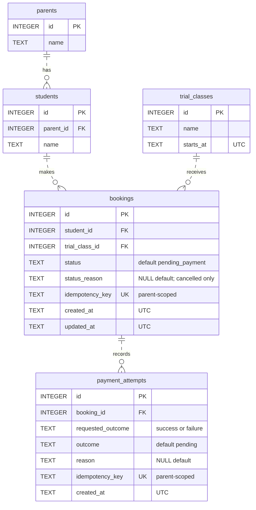
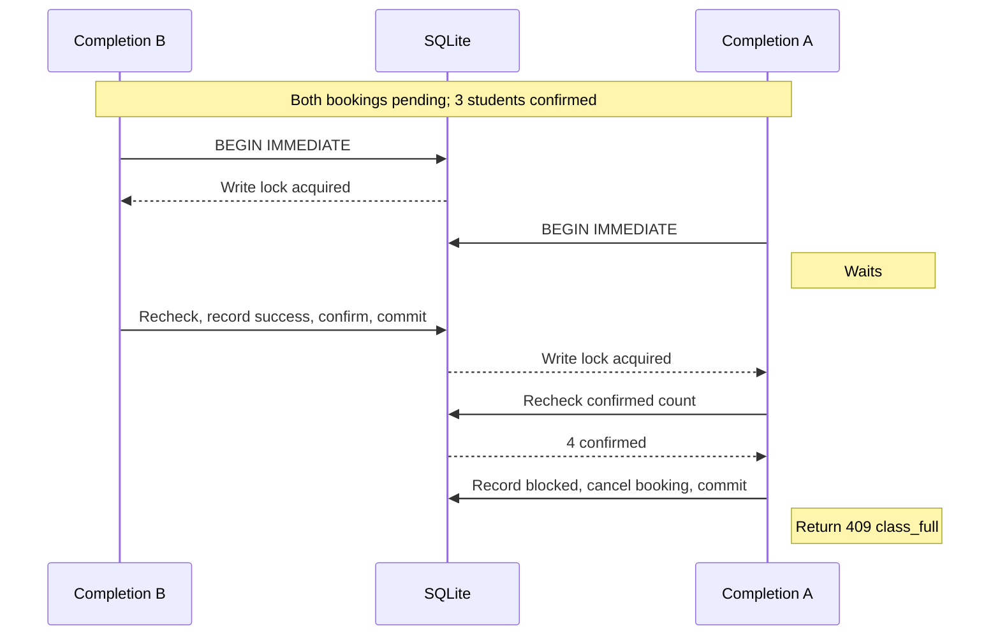

# Ottodot trial booking

## Video walkthrough

[Ottodot trial booking: demo and edge cases](https://www.loom.com/share/7a34378323f047b783bc6219ce088136)

## How to run it

Requires [uv](https://docs.astral.sh/uv/getting-started/installation/), Python 3.11+, and SQLite 3.37+. Tested with Python 3.11.15 and SQLite 3.53.1. Installation needs internet; running the app needs no credentials.

From the repository root in PowerShell:

```powershell
uv sync --extra dev
uv run python -m app.db.connection
uv run fastapi dev
```

Skip database setup if `var/trial-booking.sqlite3` already exists. For later starts, use `uv run fastapi dev`. The [CLI](https://fastapi.tiangolo.com/#run-it) shows server/docs links and reloads code changes. Stop with **Ctrl+C**.

Open [Book a trial](http://127.0.0.1:8000/v1/ui/bookings/new) or [API docs](http://127.0.0.1:8000/docs).

Startup preserves bookings. To erase demo data and reload the seeds, stop the server first, then run:

```powershell
uv run python -m app.db.connection --reset
```

Custom database: use `--db PATH` for setup and the same `TRIAL_BOOKING_DB` path for the app. Dependencies are pinned in `pyproject.toml` and `uv.lock`.

### Seed data and demo cases

| Case | Seed IDs |
| --- | --- |
| Available class | Class 1, Science explorers, zero confirmed |
| Last seat | Class 2, Math puzzles, exactly three confirmed |
| Empty roster | Class 3, Space science |
| Duplicate pair | Student 2, class 2, confirmed booking 1 |
| Payment failure demo | Pending booking 4: student 1, class 1 |
| Parent A | Parent 1, Alex Tan; children 1 Avery and 2 Kai |
| Parent B | Parent 2, Jamie Lim; children 3 Riley, 4 Sam, 5 Robin, 6 Jules |

For a successful booking, choose Alex, Kai, and Science explorers, then simulate success and open the roster. Attempt Kai in Math puzzles to see duplicate rejection. Open `/v1/ui/bookings/4?demoParentId=1` and simulate failure to confirm Avery stays off the Science roster.

## What I built

A local demo built with FastAPI, Jinja, plain CSS, SQLite, and deterministic mock payments. Parents choose a child and class, submit a booking, simulate payment, and see the result. Teachers see confirmed students only, with a limit of four per class.

### Tests and verification

```powershell
.venv/Scripts/python.exe -m pytest -q
.venv/Scripts/ruff.exe check .
.venv/Scripts/ruff.exe format --check .
```

Clean-copy verification on 9 September 2026: **81 passed, 2 warnings in 14.47s**; lint and format passed. Warnings concern Starlette's `httpx` usage and an AnyIO deprecation.

Tests cover booking rules, ownership, retries, SQL guards, rollback, timeout, API contracts, and forms. `tests/test_race.py` coordinates two connections to one temporary SQLite file, proving one last-seat winner and one recorded block. It also covers same-child contention and identical payment keys. Tests leave the demo database untouched.

Chrome verification covered the required flows and ordered race; restart preserved bookings. The uv/FastAPI CLI startup, setup, health, docs, and booking page were checked on 10 September.

## Time spent

- Planning: approximately two hours.
- Implementation used the rest of the time with the help of Codex. Total approximately 4 hours and 15 minutes, including recording and submission prep. The four-hour cap was tried to be respected; the extra 15 minutes were for recording and final edits.

## Assumptions

Data and payments are synthetic. Parent selection simulates identity; ownership checks still apply. Rosters are public, each child has one fixed parent, and class dates are fixed in October 2026 (UTC). Pending bookings and request keys are retained.

## Key architecture and backend decisions

### Approach and why I chose it

I chose one FastAPI app to serve both the JSON API and the simple UI, using Jinja templates and plain CSS. For this small booking flow, reviewers only need one server to run, with no separate frontend build step.

API and HTML routes share `app/services/bookings_svc.py`, which owns booking rules, SQL, and transactions. `app/db/connection.py` handles setup and opens one connection per operation.

I chose SQLite locking to handle the last-seat race without another service. Local mock payments keep the demo reproducible.

### Data model

Five SQLite STRICT tables use restricted foreign keys:



PK = primary key; FK = foreign key; UK = unique key. Only `status_reason` and `reason` are nullable. [Editable ERD](.specs/trial_booking_relations.drawio).

Capacity is fixed at four. Availability and rosters count confirmed bookings; pending bookings do not reserve seats.

The [full design](.specs/trial_booking_solution.md) covers the remaining constraints and request contracts.

### Endpoints

| Method | Route | Purpose |
| --- | --- | --- |
| GET | `/v1/health` | Database/table reachability |
| GET | `/v1/parents` | Demo parents |
| GET | `/v1/students` | Selected parent's children |
| GET | `/v1/trial-classes` | Classes and available seats |
| POST | `/v1/bookings` | Create a pending booking with `studentId` and `trialClassId` |
| GET | `/v1/bookings/{bookingId}` | Booking status |
| POST | `/v1/bookings/{bookingId}/payment-attempts` | Record `requestedOutcome`: `success` or `failure` |
| GET | `/v1/payment-attempts/{paymentAttemptId}` | Recorded payment result |
| GET | `/v1/trial-classes/{trialClassId}/roster` | Confirmed students |

Parent-scoped routes require `X-Demo-Parent-Id`; POSTs also require `Idempotency-Key`. UI routes use `/v1/ui`. See `/docs` for request and response contracts.

### Statuses and payment failure

New bookings start as `pending_payment`. Payment completion allows these terminal transitions:

| Booking status | Payment result | Roster effect |
| --- | --- | --- |
| `confirmed` | `succeeded` | Adds one student |
| `payment_failed` | `failed/mock_declined` | None |
| `cancelled` | `blocked/class_full` or `blocked/duplicate_booking` | None; no simulated charge |

Terminal bookings cannot be paid again. Keys are scoped by parent and operation: identical retries return the stored result; changed input returns `409 idempotency_conflict`.

### Where checks belong

| Layer | Checks |
| --- | --- |
| UI | Required choices, disabled full classes, readable outcomes. Availability is advisory. |
| Backend | Input validation, ownership, request replay, duplicate/capacity checks, payment and confirmation transaction. |
| Database | Foreign keys, types, valid states, immutable terminal records, unique confirmations/payments, and capacity guards. |
| Background job | None implemented. Later reconciliation could detect invariant violations. |

Partial unique indexes prevent duplicate confirmed child/class pairs and duplicate successful payments. Triggers reject confirmation without successful payment or with four seats already filled. Failure/cancellation requires a matching payment result.

### Last-seat race

Both bookings are pending. B acquires the confirmation lock first:



Payment and booking finalize together. Unexpected errors roll back both records and the request key, allowing a safe retry.

To demonstrate the required order with the seeded Math class:

1. In tab A, choose Alex, Avery, and Math puzzles. Submit and leave payment pending.
2. In tab B, choose Jamie, Riley, and Math puzzles. Submit.
3. Complete B's payment first. Riley takes the fourth seat.
4. Complete A's payment. A becomes `cancelled` with `blocked/class_full`; no charge is simulated.
5. Check the roster: four students, including Riley, without Avery.

## What I deliberately cut

I cut regular enrollment, real authentication, Stripe/refunds, an ORM, deployment, background jobs, seat expiry, schedule administration, and a frontend build system.

### Tradeoffs I accepted

SQLite serializes all writers, even for unrelated classes. A five-second timeout returns retryable `503 database_busy` without partial writes. Higher throughput would need a server database.

## What I would monitor after release

The app has JSON request/outcome logs and a read-only `/v1/health` check. Logs exclude names and request payloads.

After release, monitor health failures, `5xx`, database contention, latency, payment failures, and booking conflicts. Check for over-capacity classes, duplicate confirmations, confirmations without successful payments, and stale pending bookings. Alerting/reconciliation jobs are not implemented.

## What I would do next with more time

With more time, I would add real authentication and teacher authorization, define payment settlement/refunds and booking retention, and move to a server database if contention warrants it.
